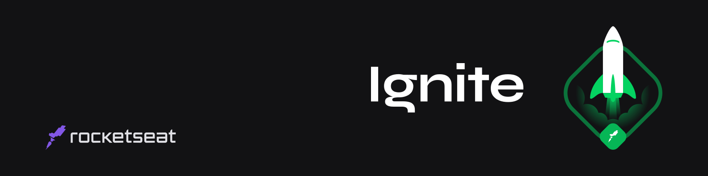

   

	

   

  <a aria-label="Completed" href="https://rocketseat.com.br/">
    </img>
  </a>

  

  

O Ignite :rocket: é um programa para estudo de  novas tecnologias, através de um currículo extremamente prático, que impulsiona seus alunos através de uma metodologia de aprendizado eficiente baseada em **Foco**, **Prática** e **Grupo**, sempre pensando nos desafios do mundo real. 

Além disso, o programa conta com uma trilha específica para o desenvolvimento de habilidades comportamentais (*soft skills*). Para consolidar o que aprendemos nas aulas e associar o conhecimento adquirido às necessidades ao mercado, participamos de: **desafios**, **eventos**, **mentorias** e outras atividades.