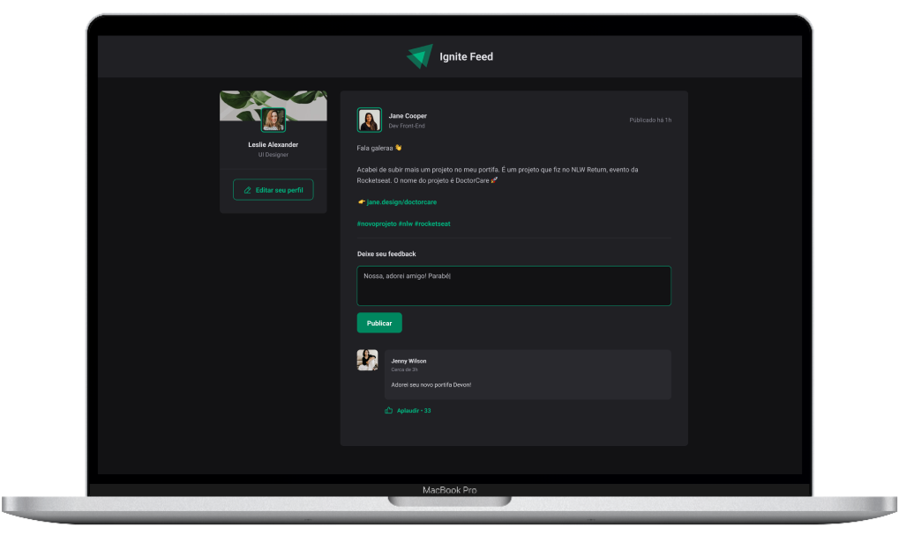
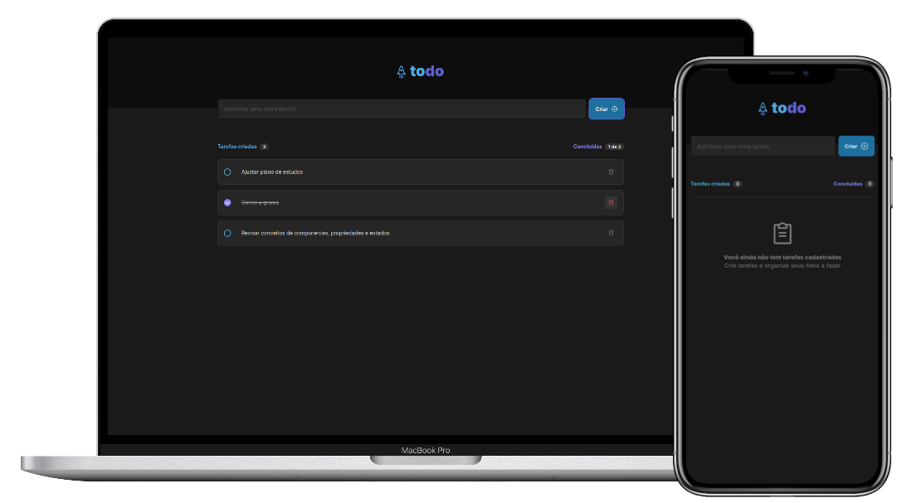
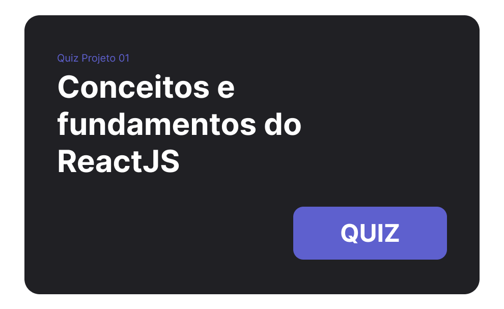
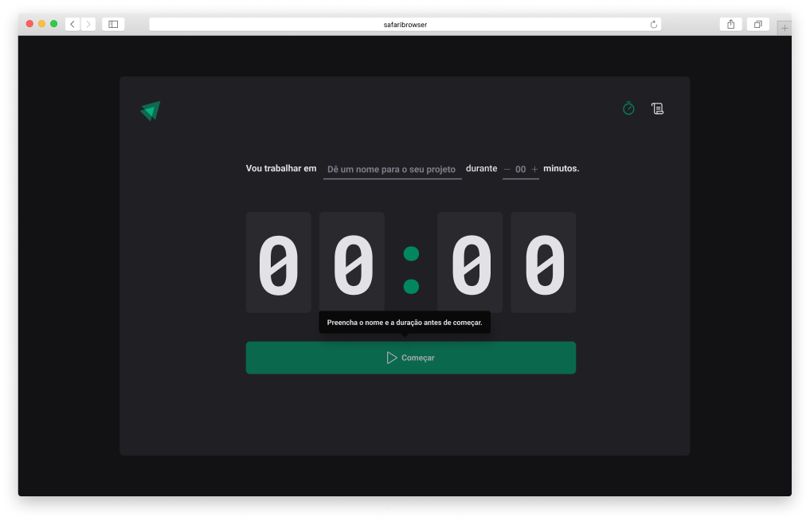
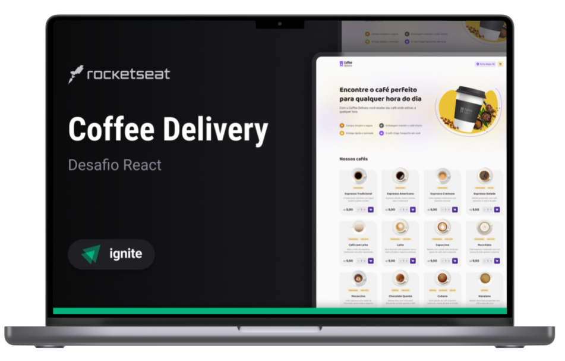
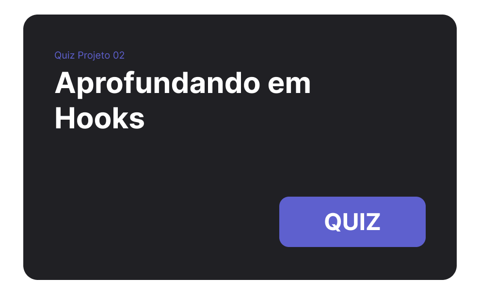
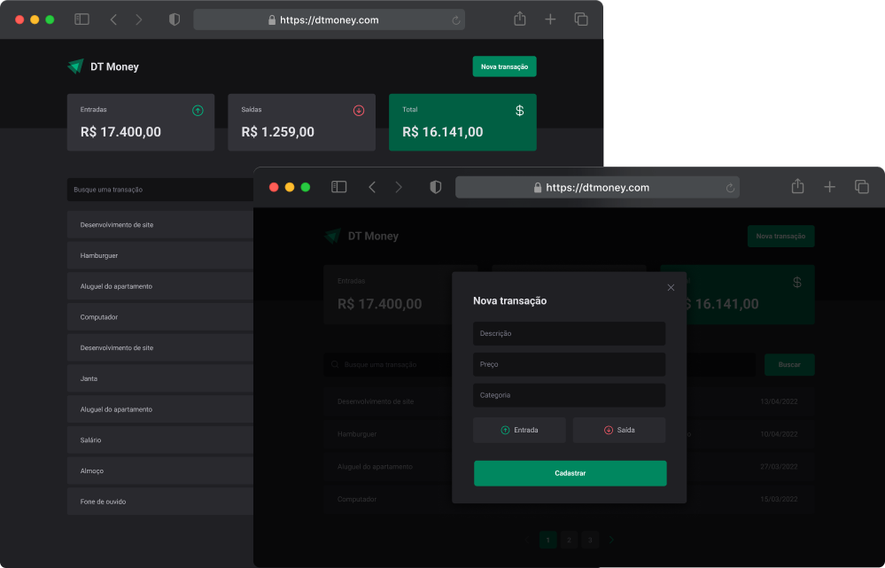
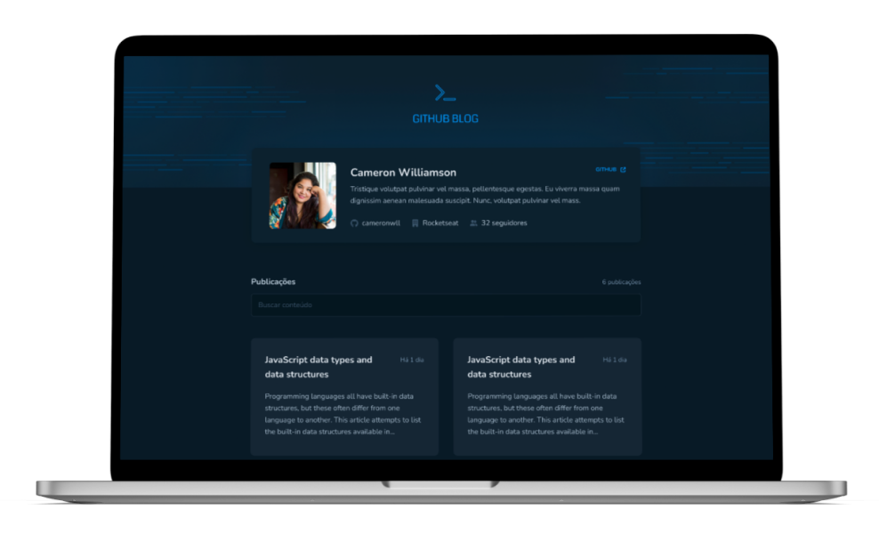
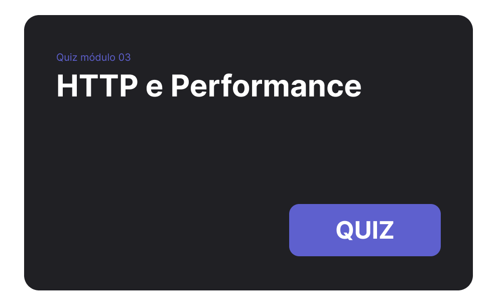
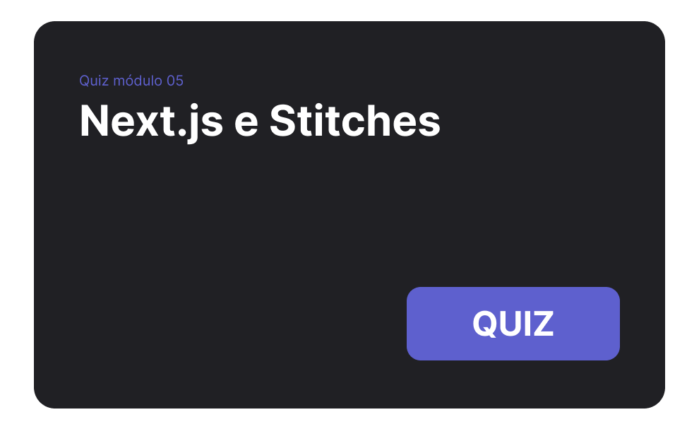

   

   

   

<a aria-label="Completed" href="https://rocketseat.com.br/">
    </img>
</a>

   

   

O Ignite :rocket: é um programa para estudo de novas tecnologias, através de um currículo extremamente prático, que impulsiona seus alunos através de uma metodologia de aprendizado eficiente baseada em **Foco**, **Prática** e **Grupo**, sempre pensando nos desafios do mundo real.

Além disso, o programa conta com uma trilha específica para o desenvolvimento de habilidades comportamentais (_soft skills_). Para consolidar o que aprendemos nas aulas e associar o conhecimento adquirido às necessidades ao mercado, participamos de: **desafios**, **eventos**, **mentorias** e outras atividades.

#### :loudspeaker: Aviso

Este repositório está dividido em duas branches (`trilha-2021` e `trilha-2022`), pois durante o seu desenvolvimento, o conteúdo do curso foi atualizado.

# Trilha React

A trilha React é focada nos principais conceitos e tecnologias de front-end, onde aprendemos a construir interfaces modernas e reativas de forma modular e escalável.

## 📚 Capítulos

### :rocket: Chapter I
Nesse módulo, criamos uma aplicação React utilizando o [Vite](https://vitejs.dev/) e aprendemos sobre os conceitos mais importantes do React, entre eles estão componentização, propriedades, estados, imutabilidade e hooks, além de aplicar o TypeScript no nosso projeto para adicionar tipagem estática à aplicação.

<table>
    <tbody>
        <tr>
            <td><h3>:computer: Projeto</h3></td>
            <td><h3>:crossed_swords: Desafio</h3></td>
            <td><h3>:heavy_check_mark: Quiz</h3></td>
        </tr>
     </tr>
      <tr>
         <td align="center">
            <h4>Ignite Feed</h4>
            
         </td>
         <td align="center">
            <h4>Ignite ToDo</h4>
            
         </td>
         <td>
            
         </td>
      </tr>
   </tbody>
</table>

### :rocket: Chapter II

Criando SPAs com ReactJS
 
Nesse módulo foi desenvolvido uma aplicação completa com roteamento e diversos conceitos importantes do ecossistema React como ContextAPI, useReducer, immer mais.

<table>
    <tbody>
        <tr>
            <td><h3>:computer: Projeto</h3></td>
            <td><h3>:crossed_swords: Desafio</h3></td>
            <td><h3>:heavy_check_mark: Quiz</h3></td>
        </tr>
     </tr>
      <tr>
         <td align="center">
            <h4>Ignite Timer</h4>
            
         </td>
         <td align="center">
            <h4>Coffee Delivery</h4>
            
         </td>
         <td>
            
         </td>
      </tr>
   </tbody>
</table>

### :rocket: Chapter III

HTTP e Performance
 
Nesse módulo foi contruído uma aplicação front-end web completa e conectada a uma API. Foram aplicados conceitos focados em performance de aplicações React, entendendo como funcionam os algoritmos internos da biblioteca e todo fluxo de renderização de componentes.

<table>
    <tbody>
        <tr>
            <td><h3>:computer: Projeto</h3></td>
            <td><h3>:crossed_swords: Desafio</h3></td>
            <td><h3>:heavy_check_mark: Quiz</h3></td>
        </tr>
     </tr>
      <tr>
         <td align="center">
            <h4>DT-Money</h4>
            
         </td>
         <td align="center">
            <h4>Github Blog</h4>
            
         </td>
         <td>
            
         </td>
      </tr>
   </tbody>
</table>

### :rocket: Chapter IV

Integrando Frontend - Backend
 
Messe módulo foi desenvolvido um projeto com foco em exercitar os conceitos sobre o React, comunicação com APIs através de requisições HTTP, testes unitários e testes E2E com Playwright . O projeto é desenvolvido utilizando Vite, React Router DOM, React Hook Form, shadcn/ui, React Query, Vitest e mais!

<table>
    <tbody>
        <tr>
            <td><h3>:computer: Projeto</h3></td>
        </tr>
     </tr>
      <tr>
         <td align="center">
            <h4>Pizza Shop</h4>
            
         </td>
      </tr>
   </tbody>
</table>

### :rocket: Chapter V

Primeiro framework
 
Nesse módulo foi desenvolvido um projeto completo com o framework Next.js. Nele foi usado a biblioteca StitchesJS para estilização, além de ter sido colocado em prática os principais conceitos sobre single-page application (SPA), server-side rendering (SSR) e static-site generation (SSG).

<table>
    <tbody>
        <tr>
            <td><h3>:crossed_swords: Desafio</h3></td>
            <td><h3>:heavy_check_mark: Quiz</h3></td>
        </tr>
     </tr>
      <tr>
         <td align="center">
            <h4>Ignite Shop</h4>
            
         </td>
         <td>
            
         </td>
      </tr>
   </tbody>
</table>