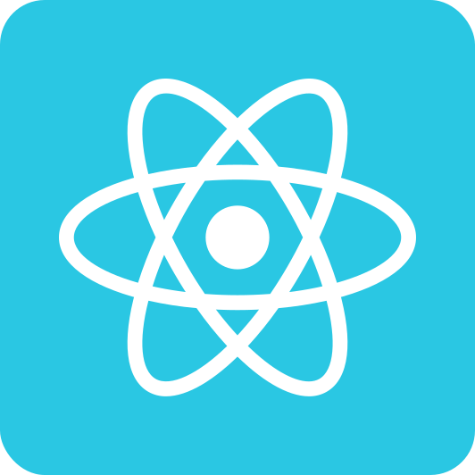

   

	

   

   

<a aria-label="Completed" href="https://rocketseat.com.br/">
    </img>
</a>

   

   

Ignite 🚀 is a program for the study of new technologies, through an extremely practical curriculum, which drives its students through an efficient learning methodology based on **Focus**, **Practice** and **Group**, always thinking about the challenges of the real world. 

In addition, the program has a specific track for the development of behavioral skills (*soft skills*). To consolidate what we learn in class and associate the knowledge acquired with market needs, we participate in: **challenges**, **events**, **mentorships** and other activities. 

#### :loudspeaker: Disclaimer
This repository is divided into two branches (`trilha-2021` and `trilha-2022`), because during its development, the content of the courses' tracks was updated.

## :tickets: Ignite tracks
Ignite has several learning paths, focused on specific technologies and areas. 

&nbsp;&nbsp;[ReactJS](./trilha_react)
