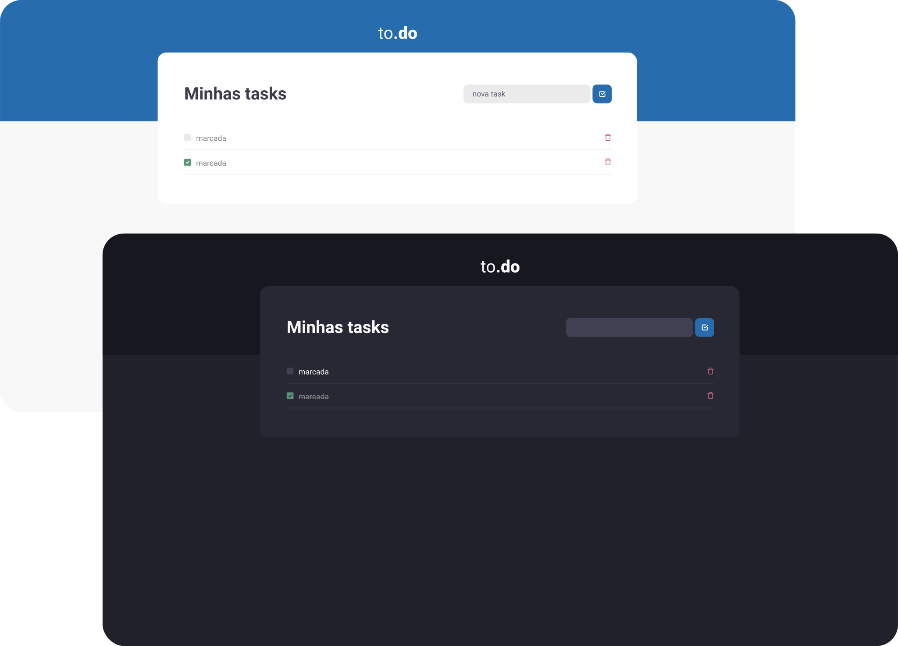

  

   

## About 📖
This application was developed as a challenge for **Chapter I (Ignite - Rocketseat)**. Its function is to create a to-do list.

## Challenges 🏆
  - [x] Function implementation that adds new tasks.
  - [x] Marking tasks as completed.
  - [x] Implementing a function for deleting a task.
  - [x] Dark theme implementation.

## Preview 📷

  

