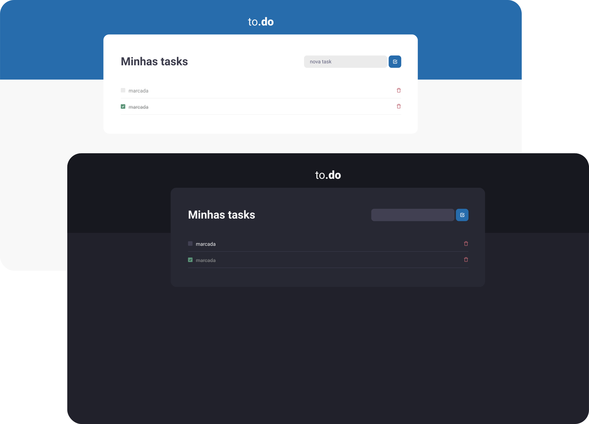

  

   

## Sobre 📖
Esta aplicação foi desenvolvida como desafio do **Chapter I (Ignite - Rocketseat)**. Sua função é a criação de uma lista de tarefas.

## Desafios 🏆
  - [x] Implementação de função que adicione novas tasks.
  - [x] Marcação de tasks como concluídas.
  - [x] Implementação de função para exclusão de uma task.
  - [x] Implementação de tema dark.

## Preview 📷

  

