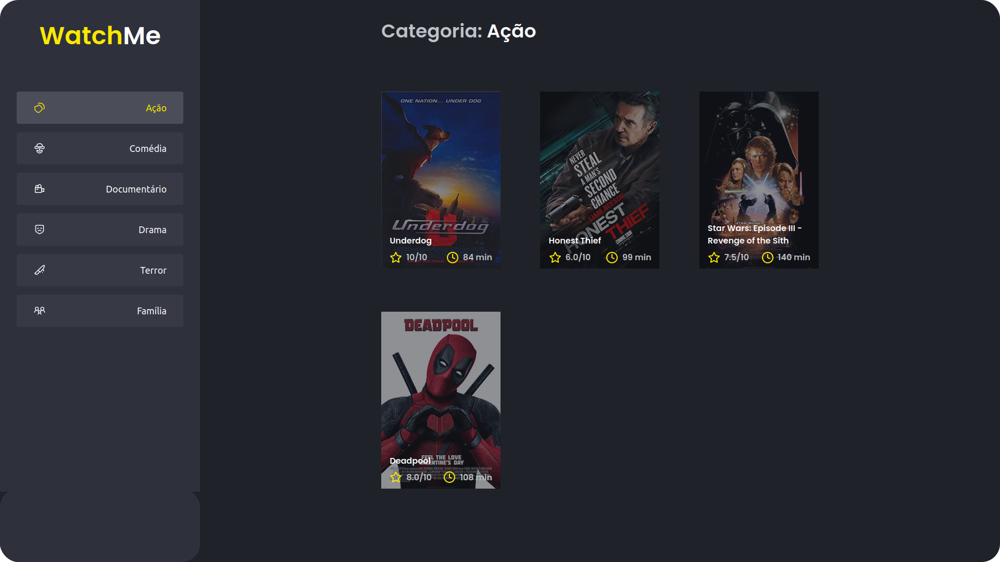

  

   

## About 📖
This application was developed as a complementary challenge to the **Chapter I (Ignite - Rocketseat)**.
## Challenges 🏆
  - [x] Perform the componentization of sections. 
## Preview 📷

  

