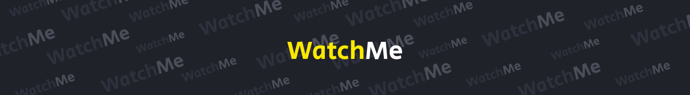
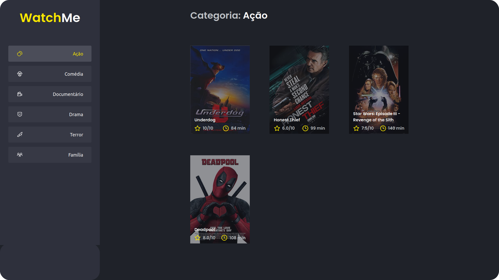

  

   

## Sobre 📖
Esta aplicação foi desenvolvida como desafio complementar do **Chapter I (Ignite - Rocketseat)**. 

## Desafios 🏆
  - [x] Realizar a componentização das seções.

## Preview 📷

  

