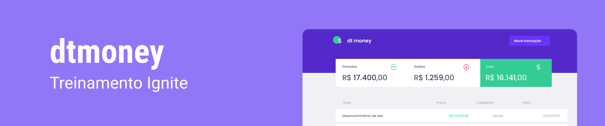
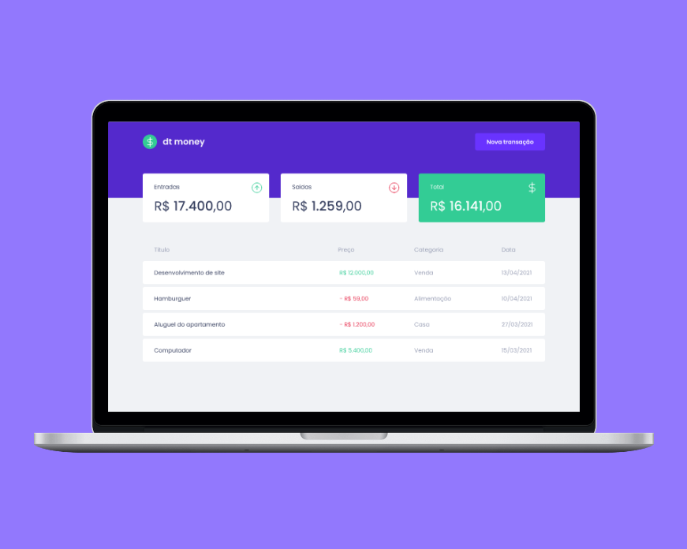

  

   

   ## Sobre 📖
Esta aplicação foi desenvolvida durante as aulas do  **Chapter II (Ignite - Rocketseat)**. 
Sua proposta é servir como organizador financeiro. 

## Challenges 🏆
  - [x] Adicionar entradas e saídas de dinheiro
  - [x] Calcular o total entre entradas e saídas
  - [x] Implementação de modal para cadastro de entradas e saídas
  - [x] Utilização de contextos
  - [x] Uso de Hooks do React

## Preview 📷

  

